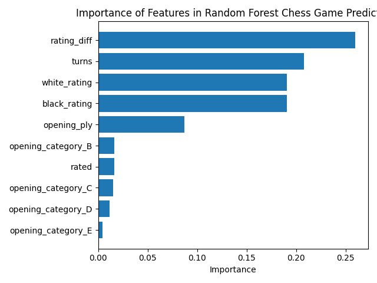

# Chess Outcome Predictor

Predicts the outcomes of chess games based on real data from Lichess using a random forest.

## Results

The model achieved 65% accuracy across three classes (white win, black win, draw).



## Key Findings

The biggest factor (most important feature) in determining the outcome of a game was the rating difference between the two players. Interestingly, the game length was also a large factor. Openings were not very important, and had very little effect on the outcome of a game. Draws were difficult to predict due to draws being less than 5% of the games in the data set.

## Tech Stack

- Python
- pandas
- scikit-learn
- matplotlib

## How to Run

```bash
git clone https://github.com/KairavT/chess-predictor.git
cd chess-predictor

python3 -m venv venv
source venv/bin/activate
pip install pandas scikit-learn matplotlib

python3 chess_predictor.py
```

Download `games.csv` from Kaggle and place it in the `data/` folder before running: https://www.kaggle.com/datasets/datasnaek/chess
